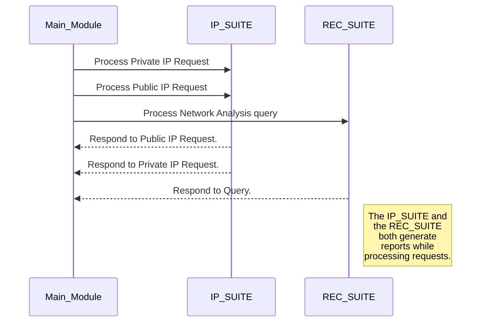

# Vulnerous

Vulnerous is a linux script that aggregates several network security and analysis features into an easy to understand package. **Vulnerous** provides a simplified **commandline** interface which is best suited for beginners and security enthusiasts trying to dive into cybersecurity.

## Suites

Vulnerous is still in development and consists of the following suites :-

- **IP Finder Suite** - The IP Finder helps you to find both your public and private IP's with a quick command.
- **Reconnaissance Suite** - The reconnaissance suite integrates several features from N-Map to intelligently find and document your results. Reports are generated to document analysed networks.

## Understanding Vulnerous

## Getting Started
> The best thing about vulnerous is its simplicity and ease of use. You don't have to understand a lot of tools and networking to generate reports! This is a true chill dream!!
